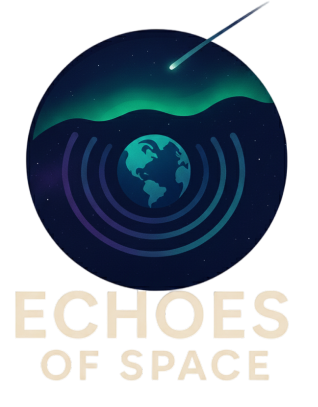

# 🌌 Voices of Space Weather

  

## 📖 Project Overview

**Voices of Space Weather** is an interactive, web-based educational platform designed for children aged **8–12 years**. The project transforms complex space weather and solar science concepts into engaging, character-driven stories that show how space weather impacts everyday life.

Through five relatable characters, children explore real-world effects of solar storms, watch short educational videos, complete quizzes, earn badges, and receive certificates — all while building curiosity and resilience toward STEM topics.

---

## 🎯 What Did We Develop?

We developed an interactive storytelling platform where users choose between **five character cards**, each representing a profession affected by space weather:

* 🌾 **Farmer Kareem** – GPS disruptions in agriculture
* ✈️ **Captain Nova (Pilot)** – Aviation communication blackouts
* 👩‍🚀 **Astronaut Chen** – Radiation and astronaut safety
* ⚙️ **Engineer Sam** – Power grid and infrastructure risks
* 👧 **Lina (Child)** – Auroras and curiosity-driven discovery

Each character features:

* An educational video
* A short interactive quiz (5 questions)
* Points, badges, and progress tracking

---

## 🚀 How Does It Work?

1. User selects a character card from the home page
2. An animated educational video plays, showing a realistic scenario
3. The user completes a short quiz based on NASA-backed facts
4. Points are awarded and badges unlocked
5. Progress is tracked across all characters (score range: 0–5)
6. Completion unlocks a **digital certificate** and achievement gallery

Navigation flows smoothly across:

* Home
* Character Videos
* Quizzes
* Achievements
* Certificates
* About Page

All interactions are enhanced with child-friendly animations and feedback.

---

## 🌍 Why Is This Important?

Space weather directly affects:

* GPS navigation
* Aviation communication
* Power grids
* Satellites and astronauts

Despite its importance, space weather is rarely taught in mainstream education. This platform:

* Builds early scientific literacy
* Encourages problem-solving and resilience
* Makes abstract science personally relevant
* Inspires future STEM careers

---

## ✅ Benefits

* **Educational Impact:** Makes solar physics memorable and relatable
* **STEM Engagement:** Encourages interest in science and engineering careers
* **Practical Awareness:** Teaches real-world technological resilience
* **Self-Paced Learning:** Supports different learning speeds
* **Global Accessibility:** Works across devices via the web
* **Community Focus:** Highlights teamwork and shared responsibility

---

## 🎯 Intended Impact

Our goal is to make **space weather literacy** a core component of global STEM education.

Long-term objectives include:

* Inspiring space science careers
* Building community resilience to technology disruptions
* Partnering with schools and NASA educational programs
* Reaching millions of students worldwide

---

## 🛠️ Tools & Technologies

### Frontend

* HTML5
* CSS3
* JavaScript

### Design & Media

* Adobe Photoshop (character illustrations)
* Canva (prototyping)
* Adobe After Effects (educational videos)
* MP4 video encoding

### Development & Hosting

* Visual Studio Code
* Git & GitHub
* GitHub Pages

### Data & Content Sources

* NASA Space Weather Database
* NOAA Educational Resources

---

## 🎨 Creativity & Innovation

The project uniquely combines **storytelling + science education**:

* Narrative-driven learning instead of lectures
* Emotionally engaging characters
* Gamification (badges, scores, certificates)
* Diverse professions for broad representation

This approach ensures multiple learning pathways and global relatability.

---

## 👥 Team Considerations

* Designed specifically for ages **8–12**
* Culturally diverse characters
* Scientifically accurate (NASA & NOAA verified)
* Accessible on low-resource devices
* Modular and scalable for future expansion

---

## 🤖 Use of Artificial Intelligence (AI)

AI tools were used **ethically and transparently** to enhance productivity — not replace human creativity.

### AI Tools Used

#### 1️⃣ Image Generation

* MidJourney & DALL·E for initial character concepts
* AI-generated assets were:

  * Watermarked as "AI-Generated"
  * Manually refined and edited by designers

#### 2️⃣ Code Assistance

* GitHub Copilot for HTML & JavaScript suggestions
* All AI-assisted code:

  * Reviewed and tested manually
  * Documented with `#AI-Assisted` comments

#### 3️⃣ Content Support

* GPT-based tools for brainstorming and language refinement
* All educational content fact-checked against NASA/NOAA sources

#### 4️⃣ Video & Animation

* AI tools for basic motion graphics and transitions
* All AI-generated video elements include watermarks and metadata

---

## 📜 Compliance Statement

* The official NASA logo is displayed on this website for educational purposes only as part of participation in the 2025 NASA Space Apps Challenge.
* The use of the NASA logo does not imply any official endorsement, sponsorship, or partnership by NASA for this project.
* The project complies with the NASA and NASA Space Apps Challenge logo usage guidelines.
* All AI-generated content is clearly documented and labeled.
* No AI-generated audio was used in this project.
* All final creative, educational, and technical decisions were made under full human supervision.

---

## 🌟 Human-Driven Innovation

The core concept, educational framework, character development, UX design, and scientific integration were **100% human-led**.

AI served only as a supportive tool to accelerate:

* Prototyping
* Iteration
* Refinement

Final decisions, creativity, and quality assurance remained entirely human-controlled.

---

## 🔍 Quality Assurance

Every element — AI-assisted or not — was reviewed for:

* Scientific accuracy
* Educational value
* Age appropriateness
* Alignment with project goals

---

## 📌 License

This project is intended for **educational and non-commercial use**. Licensing details can be added as needed.

---

## ✨ Voices of Space Weather

*Making the Sun–Earth connection understandable, personal, and inspiring for the next generation.*
